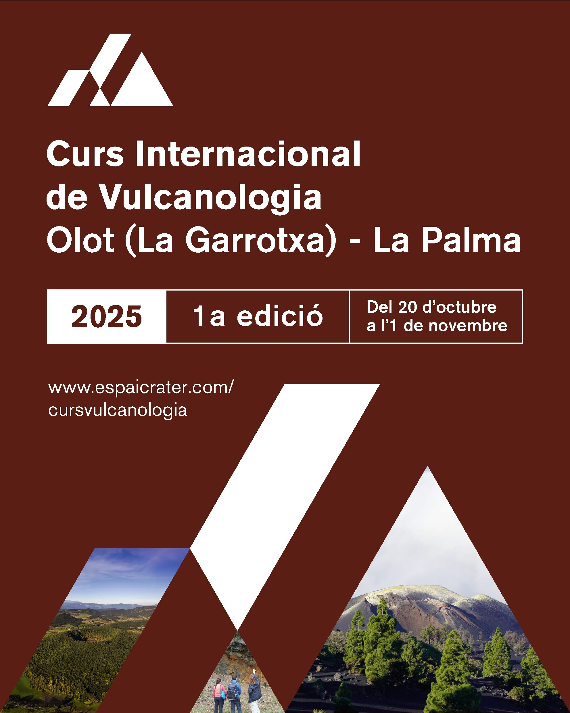

# Modelización numérica, IA y machine learning aplicado a la volcanología
***

Prácticas del módulo de modelización numérica del curso:

__Curso internacional de volcanología__

Olot (La Garrotxa) - La Palma (1a edición)

Del 20 de octubre al 1 de noviembre de 2025

## Contenido

En este repositorio se encuentra el material para las 
prácticas acorde a la siguiente estructura:

### 1. Loading an ensemble of FALL3D forecasts

En esta primera sección aprenderemos como leer los datos 
de una simulación del modelo de dispersión FALL3D y cómo 
generar mapas a partir de estos datos.

### 2. Training a Neural Network in PyTorch

Aquí se cubren las características generales de la 
biblioteca PyTorch para _deep learning_, así como los 
pasos básicos para construir una red neuronal sencilla.

### 3. A multilayer perceptron (MLP) for classification

Un perceptrón multicapa (MLP) es un tipo de red neuronal 
artificial que puede estar formada por varias capas de neuronas. 
En esta sección se entrena un sencillo MLP con una única capa 
oculta para predecir el impacto de la caída de tefra en 
La Palma tras la erupción de 2021.

### 4. Autoencoders applied to an ensemble of numerical simulations

